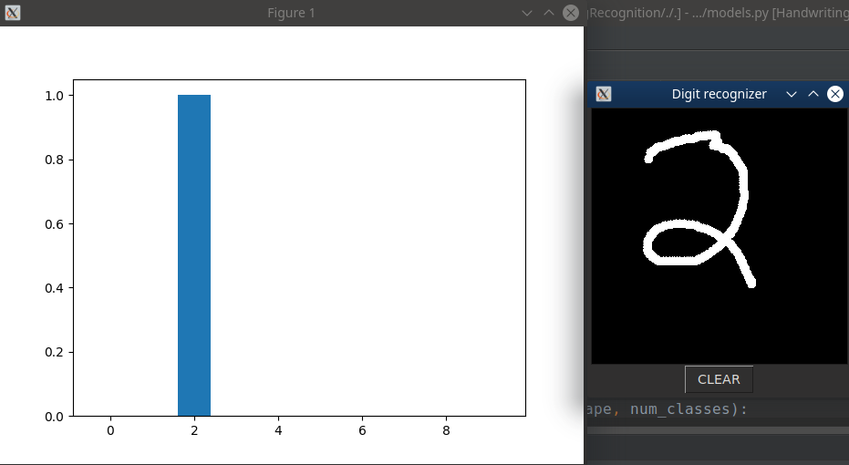

# Handwritten Digit Recognition 
  
This is a simple implementation of a basic CNN to recognize hand written digits.
### Installation
```sh
$ git clone https://github.com/shubham1172/MNISTDigitRecoginition
$ cd MNISTDigitRecognition
$ pip3 install -r requirements.txt
```
### Running
To train, 
```sh
$ python3 train.py
```
To start the interactive GUI,
```sh
$ python3 play.py
```
### Data
I have used the [MNIST dataset](http://yann.lecun.com/exdb/mnist/) for training the CNN. It contains a training set of 60,000 examples, and a test set of 10,000 examples of handwritten digits.

###  Results
 <br>
The screenshot shows a sample prediction for the digit '2'.
